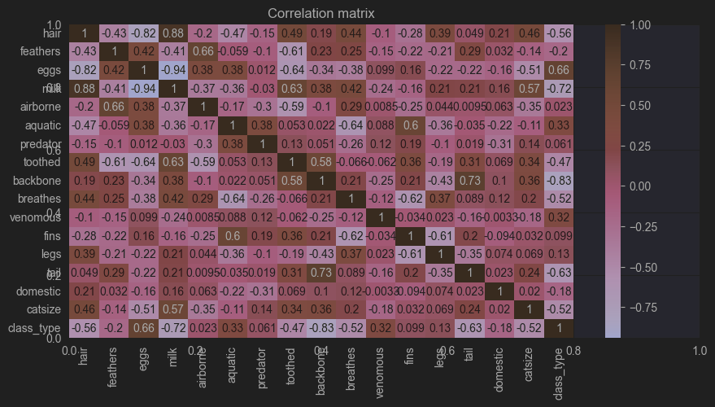

this is README, by Ikram
# Animal project presentation
This dataset consists of 101 animals from a zoo.
There are 16 variables with various traits to describe the animals.
The 7 Class Types are: Mammal, Bird, Reptile, Fish, Amphibian, Bug and Invertebrate
## Project goals

The aim of this project is to analyse how different algorithms could predict the class of an animal, with the implementation of different classification algorithms in order to compare their accuracy and have an insight of which feature(s) were the most relevant to efficiently classify the animals.
Changing to an unsupervised approach, that is, without observing the class of each animal species, I group the animal species in different clusters based on their features.

Comparing the results of each algorithm, in order to understand which one better approximates the classes provided by the dataset.

Finally, a brief description of the distinguishing characteristics of each species cluster produced by the algorithm under evaluation is given

# Table of contents
importing libraries and datasets

visualizing the class types distribution

preparing data for algorithms implementations
  - splitting data
  - feature scaling

algorthm implementation
 - K Nearest Neighbors
   - implementation 
   - prediction
   - accuracy
   - results comparison
 - Decision Tree
   - implementation 
   - prediction
   - accuracy
   - results comparison
 - Random Forest
   - implementation
   - prediction
   - accuracy
   - results comparison
 - Support Vector Machine
   - implementation
   - prediction
   - accuracy
   - results comparison
 - Naive Bayes
   - implementation
   - prediction
   - accuracy
   - results comparison 
 - algorithm comparison
 - correlation analysis
 - K Means Clustering
   - elbow method
   - implementation
   - visualization
# How does KMeans clustering work?
Once we have defined which characteristics distinguish each species we can approximate them into the clusters. Following the intuition of the K means clustering algorithm, which is to assign each observation (animal features in our case) to the cluster with the nearest mean.

#Step 1: Choose the number of clusters k

#Step 2: Select k random points from the data as centroids

#Step 3: Assign all the points to the closest cluster centroid, by calculating the Euclidean distance

#Step 4: Recompute the centroids of newly formed clusters

#Step 5: Repeat steps 3 and 4 until the formed clusters don't change anymore, meaning that the best clustering has been reached
# Project analysis
After visualizing the distribution of the animals in the different animal classes, we expect algorithms to find easier to recognise and classify mammals rather than reptiles or amphibian given the high population in the sample and consequently the high sample taken by the algorithms to learn.

From the confusion matrix we analyse features in order to see if some features are correlated with each other and therefore if they can give us insight about the class type. (hair and milk, airbone and feathers, backbone and tail)

In the last dataframe I group animal features by class type and take the mean of the values. This helps us understand which feature(s) characterize each class type so, for example if there is milk then the animal is mammal; if there are feathers then it should be bird, if it has a backbone it is definetely not a bug or invertebrate, if it breathes it is not a fish, if it has fins it is a fish...
